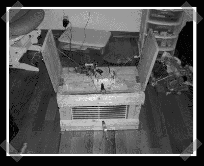

# Soekris 激光制导松鼠陷阱

> 原文：<https://hackaday.com/2008/04/16/soekris-laser-guided-squirrel-trap/>

遇到了一点害虫问题？[Chad]用一个 soekris 盒子，一个激光笔，一个串行控制继电器和一个小马达建造了一个[更好的松鼠/兔子/东西陷阱](http://www.windmeadow.com/taxonomy/term/4?page=1)。当激光束中断时，Soekris 激活继电器，拉动门栓。然后它用网络摄像头拍一张照片，并给他发送一个页面。

*   [永久链接](http://www.windmeadow.com/taxonomy/term/4?page=1)