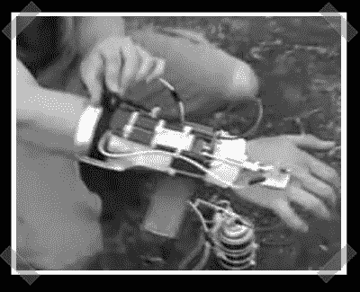

# DIY X 战警:火焰投掷护腕

> 原文：<https://hackaday.com/2008/04/22/diy-x-men-flame-throwing-wrist-guard/>

【埃弗雷特】给[送来了他机械类的](http://www.youtube.com/watch?v=Da8h6K7p31c)期末项目。为了在 X 基因上创造自己的螺栓，他制造了一个腕戴式手动火焰喷射器:Pyro 系统。腕部支架具有点火器和用于分散燃料的喷嘴。当他把手收回时，一个开关启动燃料上的伺服系统，点燃点火器。快速免责声明:不要试图复制这个！如果你想跳过电影片段，跳到 33 秒的视频。

*   [永久链接](http://www.youtube.com/watch?v=Da8h6K7p31c)