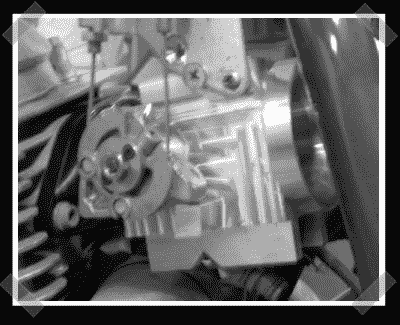

# 电喷你的摩托车

> 原文：<https://hackaday.com/2008/04/27/efi-your-motorcycle/>

[这是为了纪念我的](http://www.thumpertalk.com/forum/showthread.php?p=4725476#post4725476)[新工程自行车](http://biobug.org/index.php/2008/04/28/new-project-bike-yamaha-xs-850/)的。[wildwestsyndey]使用 [megasquirt](http://www.bgsoflex.com/megasquirt.html) 电喷控制器和定制加工的节气门体将他的铃木 DR 350 从库存碳水化合物转换为电喷。这里可以找到几张转换[的图片。为了解决日益恼人的高压燃油泵的需求，他改装了一个带机械加工的微型油箱的油箱内滑板车泵，以适应原油箱。更多的摩托车制造，请查看 megasquirt](http://www.thumpertalk.com/forum/showthread.php?p=4748490#post4748490) [成功故事论坛。](http://www.msruns.com/viewforum.php?f=93&sid=5884ebc10b486d0b27b8db4573fc46da)

*   [永久链接](http://www.thumpertalk.com/forum/showthread.php?p=4725476#post4725476)