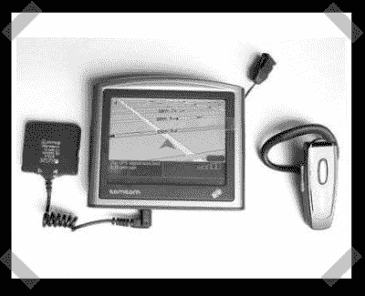

# 为您的 GPS/etc 添加蓝牙音频

> 原文：<https://hackaday.com/2008/05/03/add-bluetooth-audio-to-your-gpsetc/>

【苏迪加】写了一份漂亮的[说明书](http://www.instructables.com/id/Add-a-bluetooth-adapter-to-your-GPS-device/)关于给 tomtom gps 装置增加蓝牙音频输出。这在技术上并不太先进，但如果你的 gps 缺少音频插孔，你就必须添加一个。这看起来是一个很好的方法，把一个便宜的单位变成适合摩托车装备的东西。

*   [永久链接](http://www.instructables.com/id/Add-a-bluetooth-adapter-to-your-GPS-device/)