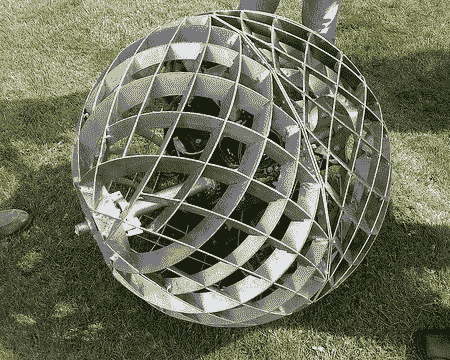

# 2008 年创客大会:虫群

> 原文：<https://hackaday.com/2008/05/06/maker-faire-2008-swarm/>

[蜂群](http://blog.orbswarm.com/)是一个大型的动感艺术项目。电动球体通过围绕中心轴移动电池来移动。通过倾斜中心环，球体也可以转向。群成员目前是无线电控制的，但计划是让他们最终接收来自母节点的命令。关于球体设计的更多信息可以在[项目维基](http://wiki.orbswarm.com/)上找到。广告之后，嵌入了一段晃动的虫子在运动的视频。

<object type="application/x-shockwave-flash" width="450" height="338" data="http://www.flickr.com/apps/video/stewart.swf?v=49235" classid="clsid:D27CDB6E-AE6D-11cf-96B8-444553540000"><param name="flashvars" value="intl_lang=en-us&amp;photo_secret=fb6437faa2&amp;photo_id=2472609162"> <param name="movie" value="http://www.flickr.com/apps/video/stewart.swf?v=49235"> <param name="bgcolor" value="#000000"> <param name="allowFullScreen" value="true"></object>