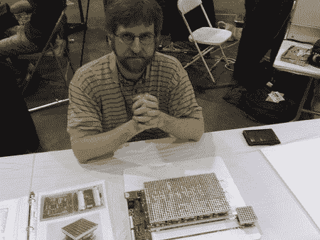

# 2008 年制造者集会:困惑

> 原文：<https://hackaday.com/2008/05/09/maker-faire-2008-puzzlemation/>

[约翰·皮特森](http://www.saccade.com/)向我们展示了他的[拼图](http://www.saccade.com/writing/projects/Puzzlemation/Puzzlemation.html)，在 Maker Faire 上的动画拼图。它最初是为 [Microchip 16 位嵌入式控制设计大赛](http://www.circuitcellar.com/microchip2007/)设计的。这个拼图由多个模块组成，每个模块都有一个 8×8 的 LED 网格。这些瓦片由电池供电，每个瓦片都有 [PIC24FJ64GA004](http://www.microchip.com/stellent/idcplg?IdcService=SS_GET_PAGE&nodeId=1335&dDocName=en026375) 微控制器。它们坐在一个托盘上，托盘上有扁平的铜条作为串行总线。托盘控制器向区块广播动画。每个单幅图块等待其唯一标识符，并保存动画的该部分。瓷砖实际上并不知道它们的顺序，所以一旦动画开始，你就可以知道它们的正确顺序；重新排列它们以便动画是正确的。休息之后我们有一段视频。
