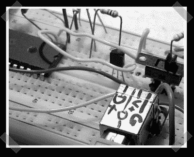

# PIC18F4550 微控制器的内核驱动程序

> 原文：<https://hackaday.com/2008/05/10/kernel-driver-for-the-pic18f4550-microcontroller/>

【Pziz】和[一起写了他的一个](http://contre.e.free.fr/drupal/?q=node/44)项目。他基于一些可用的开发工具为 PIC 18F*55*系列创建了一个 linux 内核驱动程序。继续阅读他的(略加编辑的)文章。

我想“每日黑客”的读者可能会对我做的一个项目感兴趣，这是一个法国(……)工程学校的项目。我们的目标是提供一种使用 PIC18F4550 进行纯 Linux USB 通信的方法(“Linux”部分实际上是我的想法；-) ).虽然互联网上看到的大多数涉及该芯片的项目都以某种 MS windows 驱动程序告终，但这一个展示了如何创建一个将创建简单的/dev/接口和 sysfs 属性的内核模块。

它实际上是一个修改版的 [PIC USB 框架](http://vasco.gforge.enseeiht.fr/)，它没有在固件中提供数据传输代码(除了 bootloader)，也没有内核模块，但它包括了 PIC18F*55*系列入门所需的一切:(一个编译器(sdcc)、程序员、固件和一个 USB bootloader)。

传输速度不是很快(你应该可以达到 300kB/s 左右，我用了一些技巧来获得那个速度)，但这不是 18F4550 的目的。

那个驱动是在没有内核模块“专家”任何反馈的情况下制作的，可能有很多 bug，所以如果你有任何意见，可以联系我，电话是[gmail.com](http://gmail.com/)。

此固件和驱动程序的可能发展包括适用于任何低速/全速应用的“专有”协议，但您也可以修改固件，使其表现为 HID，例如(低速输入(如键盘、鼠标等)/输出(如键盘 led 等)。))，或者大容量存储设备，这意味着无需开发驱动程序，并且能够在任何操作系统上使用。

愿黑客与你同在。

*   [永久链接](http://contre.e.free.fr/drupal/?q=node/44)