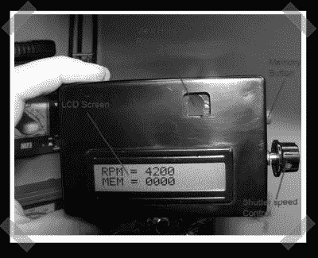

# 人类同步光学转速计

> 原文：<https://hackaday.com/2008/05/11/human-sync-optical-tachometer/>

【贾里德】[送来的这台](http://www.helifreak.com/showthread.php?t=73354)光学转速表由【迈克·弗里曼】制作。写文章和写代码需要免费注册，但是如果你已经用上了，这可能是值得的。zip 存档包括一篇 PDF 格式的精彩文章，以及 pic 控制器所需的代码。速度计是专门为模型直升机制造的。用户通过取景器观察并调整侧面的锅，直到旋转的直升机桨叶在视觉上停止转动。

*   [永久链接](http://www.helifreak.com/showthread.php?t=73354)