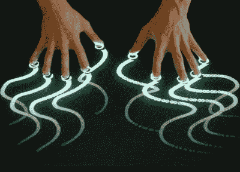

# 多点触摸项目综述

> 原文：<https://hackaday.com/2008/05/20/multitouch-project-roundup/>

似乎自从微软发布了 Surface 桌面之后，多点触控的概念就开始流行起来了。自从看到[【韩杰夫】在这方面的原创研究](http://www.perceptivepixel.com/)，我们就成了粉丝。今天早些时候，我们看了一个[多点触摸背投电视](http://www.hackaday.com/2008/05/20/multitouch-rear-projection-tv/)项目，但还有什么呢？休息之后，我们有几个多点触摸项目，你可能会感兴趣。

对于那些预算和时间有限的人来说， [MTmini](http://ssandler.wordpress.com/MTmini/) 听起来很完美。只需一个简单的网络摄像头和一些软件程序，您就可以构建自己的多点触控设备。尽管这种技术不如 IR 应用程序优雅，但它似乎可以完成任务。

CUBIT 正在采取一种独特的方式，提供开源可编程多点触控单元进行销售。他们的[触摸套件](http://nortd.com/touchkit/)产品有两种口味，800 美元的“自己动手”和 1480 美元的“全餐”服务，大部分艰苦的工作都会为你完成。

谈到多点触控，我们不能不提到苹果。他们通过 iPhone 把这项技术带给大众，值得称赞。如果最近的专利申请有任何迹象，你可以在未来的[鼠标](http://pcjoint.com/next-step-in-apple-touch-interface-multi-touch-mouse/)甚至[整个笔记本电脑界面](http://www.engadget.com/2007/08/09/revenge-of-apple-patent-attack-giant-laptop-touchpad/)上寻找多点触摸。就在上周，苹果黑客展示了 OSX 的多点触控框架 Lux。