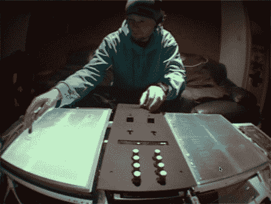

# 触摸屏转盘，无乙烯刮擦

> 原文：<https://hackaday.com/2008/05/23/touchscreen-turntables-scratching-without-vinyl/>

当我们在研究 [AudioCubes](http://www.hackaday.com/2008/05/23/audiocubes-by-percussa/) 的时候，我们遇到了这个由设计师【Scott Hobbs】设计的[令人惊叹的 DJ 系统。他称之为阿提戈 TT，它使用两个触摸屏来模拟传统系统上的转盘。休息后更多的技术细节。](http://www.scotthobbs.co.uk/)

霍布斯制造 ATTIGO 的目标是创造一种设备，让 DJ 可以像播放黑胶唱片一样播放 MP3。第一步是找到合适的触摸屏。霍布斯买了两个 17 英寸的触摸屏，把它们放在一个定制的木制外壳中，然后把两个屏幕都连接到一个混合器上。屏幕显示音频的波形，用户可以在任何位置触摸波形，并在屏幕中间的一条线上来回拖动它。根据用户的动作，音乐播放得更快、更慢或相反。

控制 ATTIGO 的软件是带有触摸屏定制补丁的 [Max/MSP](http://www.cycling74.com/products/max5) 。对于图形界面，霍布斯使用了 Flash，而 [Flashserver](http://www.nullmedium.de/dev/flashserver/) 充当了 Max 和 Flash 之间的桥梁。应用程序将与触摸屏的接触注册为鼠标点击，它还识别和使用各种其他的鼠标状态(单次点击和长时间的鼠标按下)。

很高兴看到一个超越了 [FinalScratch](http://www.stantondj.com/v2/fs/whatisfs.asp) 和 [Serato](http://www.serato.com/) 最近所做的新界面。霍布斯目前正在为阿提戈寻找制造商，所以你必须等到那时才能为自己找到一个。在此之前，请欣赏这段 ATTIGO 的视频演示。
<object width="400" height="302"><param name="allowfullscreen" value="true"><param name="allowscriptaccess" value="always"><param name="movie" value="http://www.vimeo.com/moogaloop.swf?clip_id=961877&amp;server=www.vimeo.com&amp;show_title=1&amp;show_byline=1&amp;show_portrait=0&amp;color=&amp;fullscreen=1"></object>
【via[psfk](http://www.psfk.com/2008/05/attigo-tt-the-touch-screen-turntable.html)

*   [永久链接](http://www.scotthobbs.co.uk/)