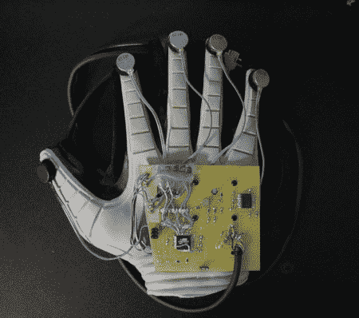
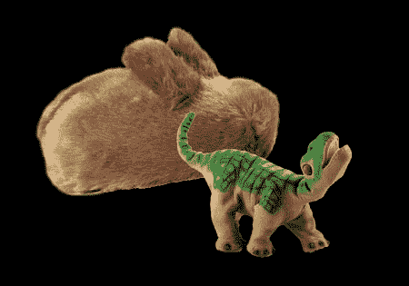
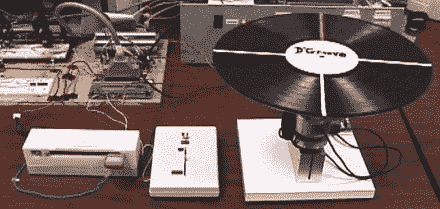

# 触觉反馈综述

> 原文：<https://hackaday.com/2008/05/23/haptic-feedback-roundup/>

Haptic feedback (sometimes referred to as tactile or force feedback) offers what some might call a [brave new world](http://www.mahalo.com/Brave_New_World) of interaction and immersion. The 1932 book of the same name was probably the first introduction many people got to the idea of computer generated touch sensations. In the book, movies are replaced with what are called “feelies”; patrons sit in chairs that provide feedback throughout the screening.

虽然我们不会很快看到这种技术出现在你当地的大都市，但我们已经开始看到这种技术悄悄进入我们的生活。休息之后，让我们看看一些例子，讨论一下我们之前讨论过的项目，以及如何开始开发自己的项目。

<object width="425" height="355"><param name="movie" value="http://www.youtube.com/v/1IKYDkDPres&amp;hl=en"><param name="wmode" value="transparent"></object>
[Novint Falcon](http://home.novint.com/products/novint_falcon.php)是首批大规模生产和消费者友好型触觉反馈设备之一。凭借 2 磅的力和 400dpi 的分辨率，该单元可以与几个软件程序和视频游戏进行交互。该设备售价约为 239 美元，包括几款兼容游戏。

Some inventors like [Steve Yohanan] feel robots need better response to the basic human touch. His latest creation the [Haptic Creature](http://technology.newscientist.com/article/dn13959-strokable-robot-rabbit-talks-with-touch.html) is a small bunny that responds to touch through pressure sensors and then responds. Different forms of touch result in the creature changing it’s breathing, purring, and of course wiggling its little bunny ears.

有趣的是，我们已经有几款内置触觉反馈功能的玩具进入市场。Pleo 是一个更先进的例子，它几乎有无限量的回应和反馈。玩具本身被吹捧为可以互动的东西，而不是简单的控制。[羽部](http://www.ugobe.com/)也在大谈其对儿童和成人的治疗价值。

虽然有些技术可能看起来超出了 DIY 的能力范围，但是有一个组织正在尝试将开源带到现场。由 [SenseGraphic](http://www.sensegraphics.com/) 支持的 [H3D API](http://www.h3dapi.org/) 是一个开源项目，帮助程序员与各种触觉设备进行交互。浏览他们的[名人堂](http://www.sensegraphics.com/index.php?option=com_content&task=view&id=24&Itemid=36)页面，看看个人和大学用 API 做了什么。该 PDF 还提供了触觉学历史的[概述。](http://www.dcs.gla.ac.uk/~stephen/workshops/haptic/papers/stone.pdf)

我们已经在 Hackaday 上报道了大量的触觉项目: [D'Groove 一个力反馈转台](http://www.timothywisdom.com/science/dgroove/dgroove.php)，一个[个人触觉雷达](http://www.k2.t.u-tokyo.ac.jp/perception/HapticRadar/index-e.html)，一个[带反馈的 PSP](http://www.acidmods.com/forum/index.php?topic=6846.new#new)，甚至[反向工程我们之前提到的猎鹰](http://qdot.livejournal.com/236133.html)。

[通过 [Gizmodo](http://gizmodo.com/392982/haptic-bunny-makes-your-heart-go-hippity+hop)