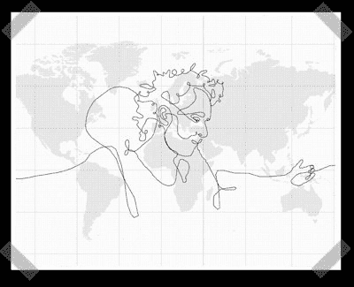

# 用 GPS 制作的世界上最大的图画

> 原文：<https://hackaday.com/2008/05/24/biggest-drawing-in-the-world-created-with-gps/>

**更新:**正文:“此为虚构作品。DHL 在任何时候都没有运输 GPS”已被添加到自最初发布以来的页面底部。

艺术家埃里克·诺德南卡创作了世界上最大的画作。至少他的网址是这么说的。他利用 GPS 设备的移动在地球上创造了一幅巨大的单线自画像。他的鹈鹕箱装有四个大电池和 GPS 数据记录器，交给了 DHL，上面有关于其 55 天旅程的非常具体的旅行说明。这是一个相当惊人的壮举，但我们真的希望在没有视频中显示的近距离观察的情况下，箱子能够成功旅行。

<http://www.youtube.com/v/irDEzQovftM&amp;hl=en>

  
【经[糯](http://waxy.org/links/)

*   [永久链接](http://biggestdrawingintheworld.com/drawing.aspx)