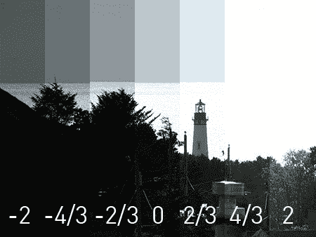

# 如何:用 CHDK 扩展你的相机

> 原文：<https://hackaday.com/2008/05/27/how-to-expand-your-camera-with-chdk/>

   

任何对佳能新的[数码 Rebel XSi](http://www.mahalo.com/Canon_EOS_Rebel_XSi_DSLR) 的技术规格感兴趣的人都知道，普通傻瓜相机的功能是非常有限的。使用 [CHDK 固件黑客](http://chdk.wikia.com/wiki/Main_Page)，佳能傻瓜相机的功能可以显著扩展，允许超高速摄影、超长曝光、延时摄影和原始拍摄。这如何提供了一个指南，我们的经验，使用 CHDK 固件，并显示它是多么容易得到更多的一点和拍摄比以往任何时候都认为可能的。

## 安装 CHDK

第一步是安装 CHDK 软件。我们在 Lifehacker [的朋友最近发表了一篇文章，详细介绍了这一点](http://lifehacker.com/387380/turn-your-point+and+shoot-into-a-super+camera)，所以我们就不再赘述了。一定要安装 Allbest build，它有所有好的特性。

安装后，当你启动相机时，你会希望固件自动加载。为此，通过按 ALT 键打开 CHDK 主菜单，然后按菜单键。向下滚动到“调试参数”，然后点击“使卡可启动…”完成后，关闭您的相机，取出 SD 卡，并切换写保护开关。当这个开关被切换，相机将自动启动到 CHDK(你仍然可以写它)。

## 长时间曝光

长曝光摄影因其柔和，有时超现实的夜景图像而受到赞赏。许多傻瓜相机只能曝光 15 秒，但有了 CHDK，你可以拍摄长达 64 秒的照片。

导航到 CHDK 的主菜单，找到额外的照片操作。在额外的照片操作中，将覆盖快门速度值更改为您希望拍摄的快门速度，例如 64 秒。向下滚动并将值因子从关闭更改为 1。

虽然相机不会显示修改后的快门速度，但变化会发生。就像平常一样拍照。一定要把你的相机调到手动模式。拍摄移动的物体最适合长时间曝光:尝试像海洋、风树和交通这样的主题。此外，使用[中性密度滤镜](http://www.cs.mtu.edu/~shene/DigiCam/User-Guide/filter/filter-ND.html)，你甚至可以在白天长时间曝光！

## 进行超快速曝光

正如你可以在长时间曝光时超越快门速度一样，你也可以进行超快速曝光，有些相机可以达到 1/100，000 秒。闪光灯的同步速度高达 1/60，000 秒，你需要曝光时间如此短的闪光灯。我们不确定这是否有用或容易使用，但结果令我们惊讶:在短短几分钟内，我们就能够捕捉到漂亮的水滴，没有一丝运动模糊。

导航到 CHDK 的主菜单，找到额外的照片操作。在额外的照片操作中，将覆盖快门速度值更改为您希望拍摄的快门速度，例如 1/16，000 秒。向下滚动并将值因子从关闭更改为 1。一定要把你的相机调到手动模式。

请注意，最小快门速度受到您在相机手动设置中选择的光圈值的限制。宽的一端(较低的数字)，通常只能拍摄到 1/8000 秒，而窄的一端(较高的数字)可以拍摄整个范围。

拍照前预对焦，可以使用手动对焦模式，也可以按住快门按钮半按。虽然相机不会显示修改后的快门速度，但它会使用短快门速度。高速摄影可以做很多不同的事情:捕捉水滴，捕捉爆炸，甚至捕捉子弹出膛。所有这些在 CHDK 都是可能的。

## 运行脚本

CHDK 的真正力量来自于运行用户制作的脚本。我们要看的第一个脚本是 intervalometer，它允许您在一段时间内拍摄许多照片。我们用它轻松地创建了一个延时视频。

   

将[这个脚本](http://chdk.wikia.com/wiki/UBASIC/Scripts:_Ultra_Intervalometer)复制粘贴到一个新文档中，保存为 ult_intrvl.bas 到你的电脑中。然后，插上你相机的 SD 卡，把 ult_intrvl.bas 复制到/CHDK/SCRIPTS/。

要使用 intervalometer，导航到主 CHDK 菜单，找到“脚本参数”，然后单击“从文件加载脚本”。找到 ult_intrvl.bas，按 set。然后，向下滚动并调整脚本参数:拍摄第一张照片的延迟时间、您希望拍摄的照片数量、每张照片之间的间隔以及您是否希望它拍摄“无限”数量的照片。然后，退出菜单，但让您的相机处于 ALT 模式，并按下快门按钮启动脚本。

上面的视频是在 2 小时 45 分钟内，以 15 秒的间隔拍摄了大约 700 张照片。只需将相机放在三脚架或其他稳定的表面上，然后启动间隔计。使用“QuickTime 专业版”,前往“文件”>“打开图像序列”,将数百个独立的图像转换成影片。出于空间和处理方面的考虑，我们建议在启动 intervalometer 之前将您的相机设置为低分辨率模式。

## 曝光包围

包围曝光允许你几乎同时以稍微不同的曝光拍摄许多照片。你可以用它来校正相机自动曝光中的错误，或者为 [HDR 摄影](http://www.flickr.com/groups/hdr/discuss/40580/)合并曝光。许多高端佳能 PowerShot 内置曝光支架，但对于那些没有的，CHDK 有答案。

与 intervalometer 脚本一样，只需将这个脚本复制并粘贴到一个新的文本文件中。将其命名为 bracketing.bas，并将其放在 SD 卡的/CHDK/脚本/文件夹中。

然后导航到主 CHDK 菜单，找到“脚本参数”，并点击“从文件加载脚本”。找到 bracketing.bas，然后按 set。然后，向下滚动并调整脚本参数。步长是所拍摄的每幅图像之间的差异，以 1/3 EV 为步长，校正是所拍摄的中间图像的 EV。这里唯一有点棘手的地方是第一个参数是(图片数量-1)/2。这意味着，如果你想要三张图片，它必须是 1，五是 2，七是 3，以此类推。要运行脚本，退出菜单，让相机处于 alt 模式，然后按下快门按钮。

使用这些不同的曝光，您可以创建 HDR 色调映射图像，显示适当曝光的非常亮和非常暗的区域。例如，将上面灯塔的七幅不同图像放入一个 HDR 程序，如 [Photomatix](http://www.hdrsoft.com/) ，优化设置以获得真实感，会产生以下结果:

你也可以用 HDR 来拍摄更具戏剧性的照片，比如这列火车。这完全取决于你如何处理图像。

HDR 有很多可以做的事情，从极其充满活力的照片到恐怖的超现实主义，比如下面这张来自 T2·提尔·克雷奇的照片。

..

想了解更多关于 HDR 摄影的信息，卡在海关有一个[精彩教程](http://stuckincustoms.com/2006/06/06/548/)。

## 拍摄原始照片

原始照片对数码摄影师来说非常有用。它们使您能够从图像中的亮点提取更多信息，RAW 使您能够完全控制白平衡。例如，在上面的照片中，JPG 有一个不正确的白平衡，这是很容易纠正使用原始图像。虽然 DSLR 提供 12 位的原始数据，但大多数傻瓜相机只能提供 10 位，这意味着即使有了 CHDK，你也无法像 DSLR 那样从高光中提取那么多信息。不过，raw 对于精确的白平衡控制非常有用。

在“Raw Parameters”菜单中，启用“Save RAW”，并调整其他参数，如图所示。现在，您可以像平常一样拍照，RAW 会自动保存到您的 JPG 中。RAW 文件将比标准 JPG 占用更多的空间，因此您的相机将无法正确显示 SD 卡上的剩余空间。

### 处理原始照片

要处理你的原始照片，你需要把它们转换成数码底片格式，DNG。 [DNG4PS-2](http://dng4ps2.chat.ru/index_en.html) 软件可以做到这一点的相机有:A610、A620、A630、A640、A710 IS、S2 IS、S3 IS、A700、G7、A560、A570 IS、IXUS 700、IXUS 70、IXUS 800、A720 IS、S5 IS、IXUS 950、A650 IS、A460、SD800 IS、A530、A540。你也可以使用 [UFRaw](http://ufraw.sourceforge.net/) 或 [dcraw](http://www.cybercom.net/~dcoffin/dcraw/) 来处理文件，尽管这要困难得多。

打开 DNG4PS-2，然后前往设置。根据您相机的百万像素调整型号设置。接下来，按确定，并找到原始文件的路径选项。这不是您要转换的文件的位置，而是包含这些文件的文件夹。当你选择了正确的文件夹，按“转换”。

dng 将保存在一个标有今天日期的文件夹中，从那里，您可以在 Lightroom、Aperture、Photoshop 或任何您喜欢的 RAW 处理软件中处理它们。

## 添加电池指示器

厌倦了低电量警告悄悄靠近你吗？CHDK 可以为你的相机添加电池指示器，尽管配置取决于你的相机类型。

要启用它，请进入主菜单中的 OSD 参数，然后进入电池。如果你有一个带 4 节 AA 充电电池的相机，编辑参数，使它们如上所示。带 2 节 AA 充电电池的相机应该是那个的一半左右。对于其他电源，进行实验以找到最佳值。

## 编写自己的脚本

CHDK 使用一种非常简单的类似 BASIC 的语言，叫做 UBASIC。它拥有任何语言的所有特性，但也有许多相机特有的特性。

### 输入/输出

每个脚本都以一个特殊的头开始，为用户提供信息和控制。

`@title Intervalometer`

在这个头中，声明了脚本的标题，以及两个用户可调整的参数。语法很简单:`@title`声明一个标题，`@param par`声明一个参数的名称和标签，`@default [par]`声明一个参数的默认值。脚本只能在开始执行时通过头部接收输入。

为了向用户输出信息，使用`print`命令:`print "Num shots: ", a`将打印脚本标题中输入的镜头数。请注意使用逗号来分隔文本和变量。`print`命令限于 25 个字符的文本。要清除已打印的内容，使用`cls`命令。

### 标准程序流程

这段代码演示了 UBASIC 语言的许多逻辑特性。要给变量赋值，使用`let`命令。还可以看到一个`for`循环和一个子程序。注意使用了`rem`命令来插入注释，以及单行`if`语句。UBASIC 支持大多数标准的数学比较，包括`+, -, *, /, %, <, >, =, <=, >=, <>` (不等于)`, &, |, ^`(异或)。

### 摄像机控制

UBASIC 的核心在于它控制摄像机的许多命令:

`shoot`

Takes a photo

`click`/`press`/`release "button"`

Clicks (press and release), presses, or releases on the cameras buttons. The following are available: `up, down, left, right, set, shoot_half` (depresses the shutter halfway)`, shoot_full, zoom_in, zoom_out, menu, display, print, erase, iso, flash, mf` (manual focus)`, macro, video, timer`.

`wait_click *timeout*`

Waits for a button to be pressed, then continues. The timeout value is optional.

`is_key x "button"`

Immediately follows a `wait_click` command. If the last button pressed is `"button"`, then the variable x is set with the value of 1\. If `wait_click` timed out, then `"no_key"` is used as the button name.

`set_tv val`

Sets the shutter speed to `val`. Note that `val` is not “1/1000” or something similar, but rather an integer value. Each increase in the integer value corresponds to a 1/3 EV increase. The absolute mapping between integer values and shutter speeds varies between cameras, but tables are available [here](http://chdk.wikia.com/wiki/UBASIC/TutorialScratchpad#The_set_tv.2C_get_tv.2C_etc_commands). This, and all following commands must be used with the camera in manual mode.

`set_tv_rel val`

Sets the shutter speed relative to the current shutter speed. Example: `set_tv_rel 0-1` increases the shutter speed by 1/3 EV.

`get_tv target`

Sets `target` equal to the current shutter speed.

`set_av val, set_av_rel val, get_av target`

With the same syntax as shutter speed commands, these adjust aperture settings.

`set_zoom val, set_zoom_rel val, get_zoom target`

Just like `set_tv/set_tv_rel` commands. In `set_zoom_rel`, `val` is +/- the relative change. Zoom values range from 0 to 8 or 14 for A-series cameras, and 0 to 128 for S-series cameras.

`set_zoom_speed x`

S-series only. Sets the zoom speed, at `x`% of maximum speed. `x` may vary between 5 and 100.

`set_focus x, get_focus target`

`x/target` is distance in millimeters.

`set iso x, get iso target`

`x/target` is one of the following values: `0 (Auto ISO), 1 (50/80), 2 (100), 3 (200), 4 (400), 5 (800), -1 (High ISO)`.

## 从这里去哪里

试着看看 CHDK 的维基，这里有更多的特色。最后，拍照！提高你的摄影技术最重要的事情就是拍大量的照片。