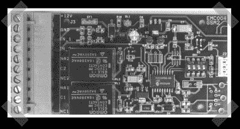

# GSM 远程控制项目

> 原文：<https://hackaday.com/2008/05/28/gsm-remote-control-project/>

已经有一段时间没有看到任何新的 SMS/GSM/串行远程接口项目了。[伊曼纽]派出[他的版本](http://dev.emcelettronica.com/reuse-your-old-personal-gsm-phone-sms-control-and-monitoring)的项目就是为了做到这一点。它使用 PIC16F84，将发送或接收命令。一对继电器提供了控制你想要连接的任何东西的选项。你需要登录，但他已经发布了完整的原理图和固件。他开发这个是为了找到旧手机的用途，但另一种选择是拿起一个便宜的电话卡手机，并将其专用于这样的项目。这似乎是给你的房子/汽车/机器人小弟添加带外报警系统的好方法。

*   [永久链接](http://dev.emcelettronica.com/reuse-your-old-personal-gsm-phone-sms-control-and-monitoring)