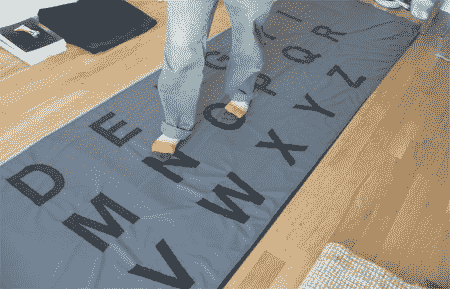
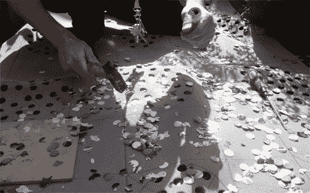
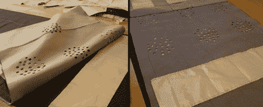

# 巨型织物键盘

> 原文：<https://hackaday.com/2008/05/28/giant-fabric-keyboard/>

【[lady ada](http://www.ladyada.net/rant/2008/05/maurin-her-lilypadwan/)】给我们指了这个由【毛林·唐纳乌】建造的巨型织物键盘的方向。它的构造看起来相当简单，就像[fbz]的 [WiFi 探测背包带](http://www.engadget.com/2005/09/13/how-to-embed-a-wifi-detector-into-a-backpack-strap/)中使用的按钮，但规模更大。休息之后，我们将带你看一下它的构造，图片等等。

[Maurin]使用了几种长度的导电织物、穿孔泡沫芯和 Arduino。

上图是正在打孔的泡棉芯。这些孔将在导电层之间产生接触点。网格显示了键盘按键在最终版本中的位置。

之后，将导电层和内泡沫层缝合在一起。导电层以相反的方向放置，形成开关矩阵。

Arduino 用于将每一步转换为一次按键。虽然完整的设计规格无处可寻，但[【莫林】的 Flickr 流](http://www.flickr.com/photos/maurin/2480355378/)上的高分辨率照片应该会给你足够的想法来构建自己的设计。

[via [ladyada](http://www.ladyada.net/rant/2008/05/maurin-her-lilypadwan/)

*   [永久链接](http://www.flickr.com/photos/maurin/2480355378/)