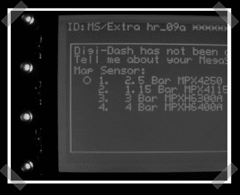

# digi dash:Megasquirt 的数字仪表盘

> 原文：<https://hackaday.com/2008/05/31/digidash-digital-dashboard-for-megasquirt/>

[digi dash 项目](http://digidash.sourceforge.net/)是一个开源的数字仪表板，专为我们在 diy [电喷摩托车帖子](http://www.hackaday.com/2008/04/27/efi-your-motorcycle/)中提到的 megasquirt 电喷系统而设计。遗憾的是，该网站没有链接硬件设计。根据描述，我假设它本质上是一个由 Atmel 微控制器驱动的图形 LCD，它与 Megasquirt 对话以获取显示信息。

*   [永久链接](http://digidash.sourceforge.net/)