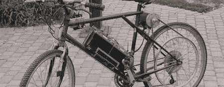

# 电动自行车

> 原文：<https://hackaday.com/2008/06/01/powered-bicycles/>

我们开始注意到街上有许多商用电动自行车。去年我们看了一个[电动三轮车项目](http://www.hackaday.com/2007/04/24/human-electric-trike-project/)，休息之后看看人们最近在做什么类似的项目。

<object width="480" height="392" data="http://flash.revver.com/player/1.0/player.swf?mediaId=346548&amp;affiliate=0" type="application/x-shockwave-flash" id="revver346548121229690993713083"><param name="Movie" value="http://flash.revver.com/player/1.0/player.swf?mediaId=346548&amp;affiliate=0"> <param name="FlashVars" value="allowFullScreen=true"> <param name="AllowFullScreen" value="true"> <param name="AllowScriptAccess" value="always"></object>

[Jeff Radtke]和[Hans Noeldner]是两位工程师，他们组装了一个独立的电动自行车车轮。该装置可以连接到任何自行车上，每次充电可以行驶 10-20 英里。通过使用标准的 Dewalt 36V 电池组，可以在需要时轻松更换新电池。总的来说，这种设置可以让你获得大约 1 马力，最大速度为 28 英里每小时。

发明家【Eric Peltzer】最近宣布他的[电动自行车项目](http://www.peltzer.net/ebike/)即将开源。在他的网站上分享了多年的经验后，他现在正在寻找贡献者来帮助开发和货币化这个项目。

前段时间他的驾照丢了，所以他为自己建造了另一种交通工具。他坦率地通过他的网站带我们参观他的[电动自行车改装](http://www.theworkshop.ca/energy/ebike/ebike.htm)的建造和调试。他甚至向我们展示了[如何*而不是*制造电动自行车](http://www.theworkshop.ca/genwork/Ebike/Ebike.htm)的过程。