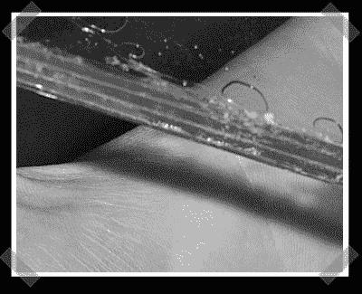

# DIY 防弹玻璃

> 原文：<https://hackaday.com/2008/06/02/diy-ballistic-glass/>

【格伦】没有上传动作镜头，但是他写了他[如何自制](http://glenn.hackleman.net/glass.html)“防弹”玻璃。想法很简单:做一个丙烯酸和聚碳酸酯塑料的复合夹层。汽车级使用玻璃和聚碳酸酯的组合。太好了，现在我的拍摄清单上又多了一件事。

*   [永久链接](http://glenn.hackleman.net/glass.html)