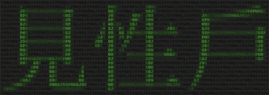

# DefCon CTF 资格赛结果

> 原文：<https://hackaday.com/2008/06/02/defcon-ctf-qualifier-results/>

上周末，
[剑宗](http://kenshoto.com/)举行了 [DefCon](https://www.defcon.org/) 夺旗大赛的资格赛。前七名选手 : Routards、Pandas with Gambas、Guard@MyLan0、Shellphish、taewon-V、WOWHACKER、PLUS 以及去年的冠军 1@stPlace 将受邀参加今年 8 月在拉斯维加斯举行的决赛。

资格赛于美国东部时间周五晚上 10 点开始，一封电子邮件(主题:m0 rt4g 3 your/14gr 4 up 2 3 1 nch 3 $)被发送给所有 451 支注册的球队。连接到游戏服务器显示一个危险风格的比分板。五个可用的类别是二进制智力、法医学、真实世界、潜在的难题和琐事，分值从 100 到 500。只开了一个问题开始。第一个回答的团队可以选择打开下一个问题，然后任何团队都可以尝试回答它。参与者被警告 500 级问题和整个现实世界类别的难度。在一切结束时，四个问题仍然被锁在最后。

如果你对竞赛的问题类型感兴趣，请查看 NOPSR 上的文章。US ，里面有所有的文件和解决方案。非资格赛选手仍然可以参加 [DC949 的 OpenCTF](http://dc949.org/oCTFIV/) 。

*   [永久链接](http://nopsr.us/ctf2008qual/)