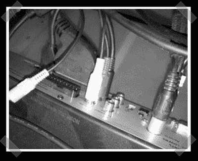

# 迪·斯林格克斯

> 原文：<https://hackaday.com/2008/06/04/diy-slingbox/>

【大卫】采取了一些有趣的步骤来[组装他自己的弹弓式设置](http://www.davidglover.org/2007/05/diy-slingbox.html)。他用一台运行 [Quicktime Broadcaster](http://www.apple.com/quicktime/broadcaster/) 的 Mac mini 从他的有线/卫星接收器所插入的 Firewire 摄像机中捕捉视频流。你必须使用一台 OS X 机器，但现在这并不太难。Broadcaster 是从 Firewire 和 stream 中捕获的最简单的方法。我们在自己的办公室里用它来广播加拿大卫星电视的信号。

*   [永久链接](http://www.davidglover.org/2007/05/diy-slingbox.html)