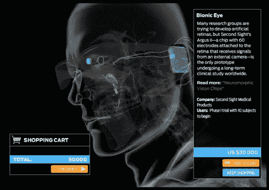

# 仿生感官

> 原文：<https://hackaday.com/2008/06/05/bionic-senses/>

[各种控制肢体和器官替代物](http://www.spectrum.ieee.org/bionic)最近在 IEEE 的 flash 演示中亮相，名为仿生身体商店，但我们最感兴趣的是仿生眼和人工耳蜗(我们已经讨论过特色的电动外骨骼)。值得注意的是，它们不仅仅是绑在或戴在身体上的高科技假体替代品，而是位于体内的植入物，与血肉感觉器官在比任何先前技术更近的水平上合作。

Argus II 视网膜刺激系统是生物技术公司 [Second Sight 的仿生眼](http://www.2-sight.com/index.html)，它的工作原理是将 60 个电极直接连接到视网膜上，刺激明暗感受器，形成人脑可以解析的图像。电极还连接到植入颅骨更深处的小外壳单元；外壳单元包含电池、视频处理器和无线接收器。接收器从安装在眼镜上的小型摄像机获取视频数据。这项技术目前正在临床试验中，只使用 50 岁以上逐渐丧失视力的患者，而不是终生失明的患者。

flash 演示中几乎没有关于人工耳蜗的数据，所以我们选择了一家制造商 [Med-El](http://www.medel.com.ar/ENG/US/10_Understanding_CI/20_Understanding_the_CI/040_understanding_ci.asp) 来了解更多信息。他们的植入物与视网膜植入物的工作方式非常相似，在头部植入电子元件的外壳和直接刺激用户耳蜗的电极阵列。佩戴在外部的语音处理器拾取声音并将其转换成数字数据。数据通过一个线圈传输到内部外壳中的接收器，接收器将数据传递到电极。电极刺激耳蜗，用户听到声音。虽然现在已经有了，但是只有严重听力损失的病人才有资格。

关于这两种设备，值得注意的一件有趣的事情是，它们直接用数字数据刺激感觉器官。虽然最实际的应用是恢复失去或损坏的感官灵敏度，但不难想象，这些也可以用于任何人，并用于将音乐直接传入耳朵，或将文本或图像等视觉数据直接传入眼睛。有趣的事情，只要确保过程不会让你发疯。