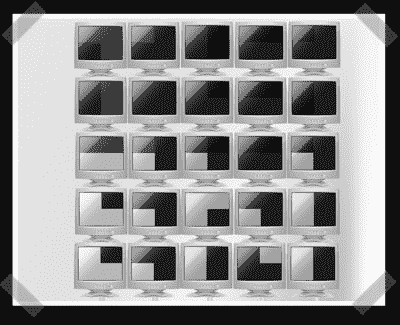

# CRT 闪烁灯光

> 原文：<https://hackaday.com/2008/06/06/crt-blinkenlights/>

【朱利安】派出他的小组的[扭](http://www.brouchier.com/blinkenlights.png)在现在经典的[闪光灯项目](http://blinkenlights.de/)。奇怪的是，这篇文章完全是 jpg 格式的，所以我不知道他是否已经完成了。他们中的一个人承诺在我们的旧 CRT 显示器的新用途发布会上把它发过来，所以很高兴听到一些关于它的消息。虽然经典的 blinkenlights 使用建筑物的窗户作为像素，但这个版本将 CRT 显示器分成四个正方形。

*   [永久链接](http://www.brouchier.com/blinkenlights.png)