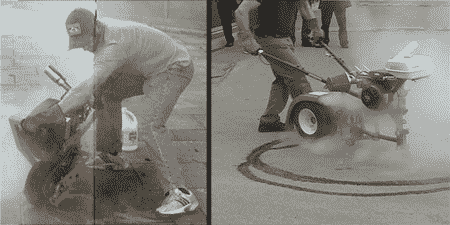

# 史蒂文·劳里的汽车艺术

> 原文：<https://hackaday.com/2008/06/09/steven-lauries-art-of-the-motor/>

我们已经提供了几十台甚至几百台具有实用目的的机器，但我们总是对那些[史蒂文·劳里]制造的机器感兴趣，这些机器除了看起来令人印象深刻、喷出烟雾、留下轮胎印和制造大量噪音之外没有其他用途。休息之后我们会给你史蒂夫汽车艺术的独家新闻。

<object width="425" height="344"><param name="movie" value="http://www.youtube.com/v/Guy_YDc1iro&amp;hl=en"></object> 
【史蒂文·劳里】是安大略省惠特比的本地人，当地一家名为[车站画廊的画廊正在展出他的电动艺术品](http://www.whitbystationgallery.com/current.php?id=AMW-32)。在那里[劳里]展示了他的 [Posi-Track Burnout Machine](http://www.flickr.com/photos/stevenlaurie/sets/72157604033232029/) ，它看起来有点像坐在车轴顶端的加大马力的割草机。然而，烧尽机器不是沿着草地推进，而是逆着路面加速，在沥青上产生刹车痕迹，因为它逆着司机的抓地力向前推进。

劳里的另一个机器，[手持橡胶燃烧器](http://www.flickr.com/photos/stevenlaurie/sets/72157600447989701/)，做的事情和烧尽机差不多，除了不是制作长的刹车痕迹，而是用来创建用户设计的刹车痕迹。这台定制的机器足够小，可以用双手握持和指挥。出于同样的目的，他还设计了一种类似的设备，称为固定橡胶燃烧器(也称为[甜甜圈机](http://www.flickr.com/photos/stevenlaurie/sets/72157604033237967/)),但它只能产生圆形的刹车痕迹，因为它是围绕中心柱旋转的。所有三台机器都会产生刹车痕迹，但真正的艺术在于表演，轮胎尖叫，引擎加速，空气中弥漫着橡胶燃烧的气味和烟雾。

<object width="400" height="300"><param name="allowfullscreen" value="true"> <param name="allowscriptaccess" value="always"> <param name="movie" value="http://www.vimeo.com/moogaloop.swf?clip_id=89948&amp;server=www.vimeo.com&amp;show_title=1&amp;show_byline=1&amp;show_portrait=0&amp;color=&amp;fullscreen=1"></object> 
为了发动机加速声音的纯粹内脏感觉，劳里创造了[吊杆管](http://www.flickr.com/photos/stevenlaurie/sets/72157594308439583/)。这是一台安装在支架上的割草机发动机，排气管向上伸出。它无非是闲着，制造出一种与众不同的声音。

他的[固定转速机器](http://www.flickr.com/photos/stevenlaurie/sets/254989/)是一个稍微更具互动性的概念。它只不过是一个带有油门踏板的发动机，但就像他的其他作品一样，它旨在唤起与肌肉车相关的声音和气味。

劳里如果不彻底就什么都不是，一台被他命名为[野生动物](http://www.flickr.com/photos/stevenlaurie/sets/276007/)的小型加速机器就是证明。只是一个排气尖很大的电锯，没有切割能力。

另外两台机器，Ape Hanger Rumbler 和[割草/掘墓机](http://www.flickr.com/photos/stevenlaurie/sets/72157604465768300/)也是展览的一部分。尽管我们知道你喜欢实用的机器，但如果你在安大略地区，我们建议你在这个展览上考虑一下你的装备欲望。如果没有，看看[【史蒂文·劳里】的 Flickr 流](http://www.flickr.com/photos/stevenlaurie/)。

*   [永久链接](http://www.whitbystationgallery.com/current.php?id=AMW-32)