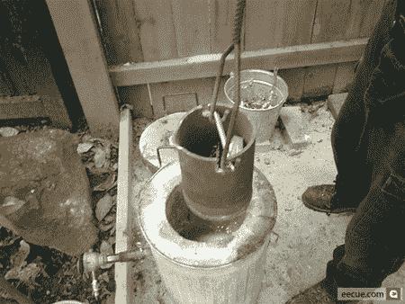

# 驱渣

> 原文：<https://hackaday.com/2008/06/11/drive-slagging/>

也许你[用音乐填充硬盘来清除你的 iPhone](http://www.hackaday.com/2008/05/20/erase-an-iphone-properly/)，或者也许你[用了更复杂的方法](http://www.hackaday.com/2008/06/10/wiping-an-iphone-more-thoroughly/)。在这两种情况下，你的手机是干净的，但你电脑的硬盘里仍然塞满了你的不端行为的证据(或者只是给你母亲的私人邮件)。如果你担心法庭分析会暴露你的交易，那么完整的格式是不够的；你得清除硬盘里的车牌。

为此，【Eecue】发布了[这篇清理硬盘](http://driveslag.eecue.com/)的日志。他使用丙烷动力熔炉，将驱动器的大部分组件放入钢坩埚中熔化，然后将坩埚放入熔炉中。几分钟后，除了钢制外壳和 PCB 上的一些编织玻璃纤维，其他东西都完全熔化了。在[【ee cue】的开车造渣相册](http://eecue.com/images_archive/eecue-album-1274-1-drive_slagging.html)里可以看到整个过程。

随着固态硬盘越来越受欢迎，以及它们固有的确保擦除的困难，物理销毁看起来是一个更合理的选择。正如你的读者在过去所说的那样:[这肯定要有趣得多](http://www.hackaday.com/2007/12/25/holiday-hackit-automated-hard-drive-destruction/)。

*   [永久链接](http://driveslag.eecue.com/)