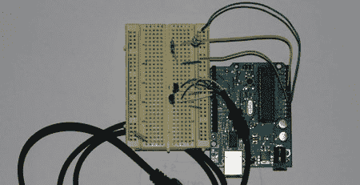

# 相机闪电捕捉

> 原文：<https://hackaday.com/2008/06/11/camera-lightning-capture/>

【Hobby Robotics】的人决定为闪电摄影建造一个[触发电路。有](http://www.glacialwanderer.com/hobbyrobotics/?p=16)[更复杂的方法](http://solorb.com/elect/lightning/index.html)来做到这一点，但他们只是用了一个光电晶体管和一个 Arduino。Arduino 会观察光电晶体管的值，并将其与之前捕获的值进行比较。如果差异超过某个阈值，这意味着光量发生了快速变化，从而触发快门。早先的一篇文章报道了如何使用 Arduino 直接控制佳能 30d。所有这些工作都是因为快门延迟和代码执行加在一起少于 lighting 的 100 毫秒持续时间。

*   [永久链接](http://www.glacialwanderer.com/hobbyrobotics/?p=16)