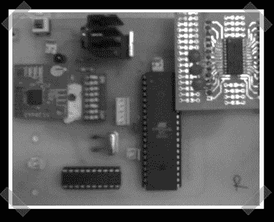

# 加速度计鼠标从零开始

> 原文：<https://hackaday.com/2008/06/12/accelerometer-mouse-from-scratch/>

【maha vir】送来了[他的小组的期末项目](http://coepetc.blogspot.com/)为浦那的工程学院([就在这里](http://maps.google.com/maps?ie=UTF-8&oe=utf-8&rls=org.mozilla:en-US:official&client=firefox-a&q=Pune,+Maharashtra+India&um=1&sa=X&oi=geocode_result&resnum=1&ct=title))。他们制造了一个基于加速度计的蓝牙鼠标。他们最终创造了一种将旋转运动映射到 x/y 运动的鼠标。从视频运动来看，我们觉得它的反应方式和触摸鼠标一样。您可以在休息后点击演示视频或从项目页面获取更多详细信息。即使你不喜欢鼠标，你也可以从他们的蓝牙实现中学到一些东西。

<object width="450" height="364"><param name="movie" value="http://www.youtube.com/v/RdU6nDrc9vE&amp;hl=en&amp;rel=0&amp;color1=0x3a3a3a&amp;color2=0x999999"></object>

*   [永久链接](http://coepetc.blogspot.com/)