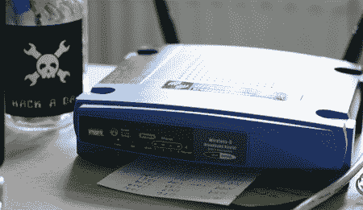

# 恶意软件改变路由器上的 DNS 数据

> 原文：<https://hackaday.com/2008/06/12/malware-alters-dns-data-on-routers/>

Zlob 木马，也被称为 DNSChanger，已经存在了几年，但是[最近出现的 Zlob 变种](http://blog.washingtonpost.com/securityfix/2008/06/malware_silently_alters_wirele_1.html)试图使用一系列默认的管理员/密码组合登录路由器。如果成功，他们会更改路由器上的 DNS 记录，通过攻击者的服务器重新路由流量。

我们的朋友[Dan Kaminisky]最近做了一个演讲，警告互联网浏览器插件中的[漏洞，这些漏洞允许攻击者使用默认密码对路由器发起 DNS 重新绑定攻击..虽然它达到了相同的目的，但 Zlob 是不同的，因为它通过一种屡试不爽的方法感染，欺骗用户在一个假的视频编解码器中下载它。一旦它在客户机上运行，就可以尝试使用路由器的默认管理员 id 和密码登录并更改 DNS 设置。它甚至支持](http://www.darkreading.com/document.asp?doc_id=150567) [DD-WRT 固件](http://www.dd-wrt.com/dd-wrtv3/index.php)。

即使系统被清除了 Zlob 特洛伊木马，路由器仍然可能受到威胁。好消息是它很容易修复，甚至更容易预防。修复它只需要清除所有网络客户端，然后重置路由器和恢复自定义设置。预防只是简单地更改路由器的密码。

[图片: [fbz](http://www.fabienne.us/blog/news/300/getting-DNS-to-stick-in-OpenWRT)

*   [永久链接](http://blog.washingtonpost.com/securityfix/2008/06/malware_silently_alters_wirele_1.html)