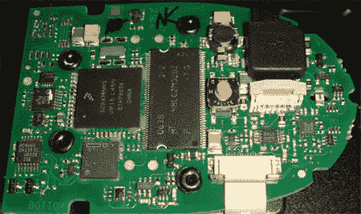

# 说出那件商品的名称

> 原文：<https://hackaday.com/2008/06/12/name-that-ware-2/>

猜谜游戏很好玩，尤其是涉及到未命名的硬件和奖品的时候。[邦尼]每月在他的博客上举办一次[命名竞赛；他张贴了一张硬件组件的图片，如上面的 PCB(这是 May 的神秘器皿)，并要求访问者尝试猜测它来自哪台机器或至少它的功能。除了他颁发的奖品之外，获胜者还会得到所有奖励中最令人垂涎的:吹牛的权利。他举办每月一次的竞赛已经有一段时间了，而且并不总是多氯联苯；过去的产品包括这个](http://www.bunniestudios.com/blog/?p=250)[微米厚度规](http://www.bunniestudios.com/blog/?p=215) ( [内部](http://www.bunniestudios.com/blog/?p=211))和一个[x 射线晶体振荡器](http://www.bunniestudios.com/blog/?p=200)。