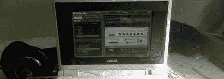

# 使用 Eee PC 制作音乐

> 原文：<https://hackaday.com/2008/06/13/making-music-with-the-eee-pc/>

创造数字音乐一直在密切关注华硕 Eee PC。笔记本电脑的便携性和低廉的价格--比唱盘还便宜--使它们受到制作人和表演者的青睐。 [CDM 已经收集了许多人的链接](http://createdigitalmusic.com/2008/05/30/asus-eee-as-cheap-tiny-music-pc-guitar-rig-3-linux-tips/)，他们正在研究如何利用这个轻量级平台。[丹·斯托维尔]为超级对撞机、[实时音频合成引擎](http://supercollider.sourceforge.net/)编写了一个[教程。这台机器也适合简单的基于文本的跟踪软件。在 Windows 端，很多软件，像](http://www.mcld.co.uk/supercollider/eee/)[吉他架](http://www.native-instruments.com/forum/showthread.php?t=65745)，只需要一点点显示驱动程序的破解就可以启用。这真的让我们想知道什么时候我们会看到第一个 Eee PC keytar mod。

*   [永久链接](http://createdigitalmusic.com/2008/05/30/asus-eee-as-cheap-tiny-music-pc-guitar-rig-3-linux-tips/)