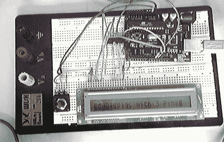

# 三线液晶显示器

> 原文：<https://hackaday.com/2008/06/13/3-wire-lcd-display/>

正常情况下驱动一个液晶显示器需要 7 个连接到显示器上的引脚，但是通过使用移位寄存器，Arduino Playground 的【Phillip Warner】能够[只用 3 根线驱动一个液晶显示器](http://www.arduino.cc/playground/Code/LCD3wires)。这种方法比串行 LCD 便宜，但使用它主要会节省您的大量精力和时间。

[Warner]使用 HEF4094 芯片将线条组合在一起，并使用一个可变电阻来控制对比度。[可以在帖子中找到一个 zip 文件，其中包含完成这项工作所需的代码](http://www.arduino.cc/playground/uploads/Code/LCD3WireLibrary.zip)。

[途径〔t0〕你的电子〔t1〕

*   [永久链接](http://www.arduino.cc/playground/Code/LCD3wires)