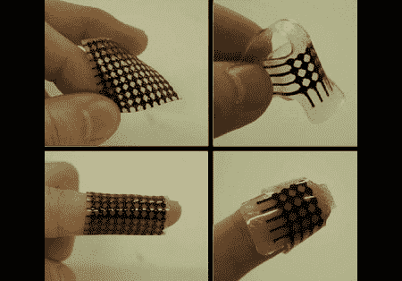

# 可穿戴触觉设备赋予第六感

> 原文：<https://hackaday.com/2008/06/13/wearable-haptic-devices-bestow-sixth-senses/>

Engadget 最近在[上发布了一个关于柔性触觉显示器的故事](http://www.engadget.com/2008/06/10/researchers-show-off-flexible-band-aid-sized-tactile-display/)，它可以缠绕在身体的任何部位，并向用户提供触觉反馈。来自韩国成均馆大学的研究团队开发了这种设备，他们正专注于像为视力障碍者提供盲文或向远程用户传输触觉数据这样的应用，但这只是一个开始；可穿戴触觉反馈的应用非常广泛。

Feelspace 触觉罗盘就是一个很好的例子。它比[一个电子罗盘好不了多少，与沿着腰带排列的振动器阵列相连](http://feelspace.cogsci.uos.de/en/technology_01.html)，但它允许佩戴者通过只向最北的振动器发送脉冲来随时知道哪边是北。它可以一直戴着，所以它为用户创造了一种方向第六感，而不需要经常检查设备。如果他们能够减小外壳的尺寸，并将其与这些新的显示器结合起来，它就可以穿在衣服下面，不显眼。

如果你想要更多的原生超能力，body modder【史蒂夫·霍沃斯】有一个解决方案。通过[将一个涂有硅树脂的钕磁铁植入指尖](http://www.bmezine.com/news/pubring/20040226.html)，植入者能够以简单地拿着磁铁无法达到的灵敏度感知磁性。一个植入了磁铁的人报告说在图书馆感觉到了磁传感器，并且感觉到了离他的手 6 英寸的电动开罐器的马达位置。

我们总是对通过佩戴或植入设备输入到身体的[输入感到好奇，随着这些进步，数据和感觉整合的概念几乎是显而易见的现实。一语双关，但你能责怪我们吗？](http://www.hackaday.com/2008/06/05/bionic-senses/)

[via [Engadget](http://www.engadget.com/2008/06/10/researchers-show-off-flexible-band-aid-sized-tactile-display/)