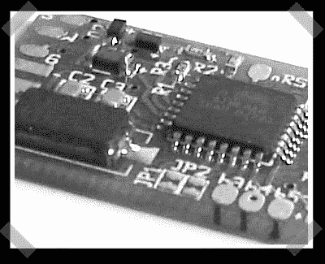

# 通用操纵杆 USB 接口

> 原文：<https://hackaday.com/2008/06/14/universal-joystick-usb-interface/>

在他的 [USB NES pad 接口](http://www.raphnet.net/electronique/snes_nes_usb/index_en.php)，拉斐尔【发布了[通用 USB 操纵杆接口](http://www.raphnet.net/electronique/usb_game12/index_en.php)。它展示了具有四个方向按钮和八个通用按钮的 HID 设备。该板使用 ATmega8，并完全通过软件实现 USB。

*   [永久链接](http://www.raphnet.net/electronique/usb_game12/index_en.php)