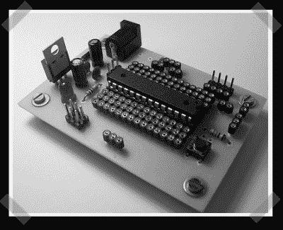

# 单面 Arduino-ish 测试板

> 原文：<https://hackaday.com/2008/06/15/single-side-arduino-ish-beta-board/>

通过[ [ladyada](http://www.ladyada.net/rant) ，【Raijuu】结合了来自【ladyada】的 [boarduino](http://www.ladyada.net/make/boarduino/) 和【evimmadscientists】[Atmel 名片](http://www.evilmadscientist.com/article.php/card)的一些想法，为 ATMega8/128 项目创造了[他自己的单面(为了容易蚀刻)项目板。你可以看出这个设计表达了过去项目的挫败感；我们肯定会欣赏像独立电源和每个引脚上的多个插座这样的功能。(我们可能会考虑增加一些焊接点，以便永久连接。)](http://www.raijuu.net/2008/06/beta/)

*   [永久链接](http://www.raijuu.net/2008/06/beta/)