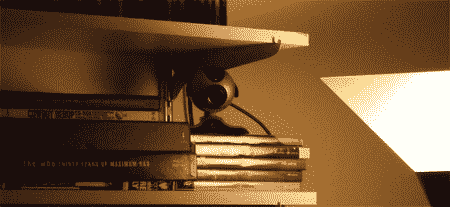

# 推特安全摄像头

> 原文：<https://hackaday.com/2008/06/16/twitter-security-cam/>

似乎人们不断想出别出心裁的东西来用 Twitter。[提醒你给植物浇水](http://www.hackaday.com/2008/05/22/twittering-from-the-command-line/)相对来说很有创意，但是为了实用起见，[用一个网络摄像头](http://tech.shantanugoel.com/2008/05/14/keep-tab-on-home-security-with-a-webcam-and-twitter.html)，几个免费软件应用程序和一个推特账户创造了一个安全摄像头。

为了实现这一点，[在运行 Linux 的系统上安装 Motion](http://www.lavrsen.dk/twiki/bin/view/Motion/DownloadFiles) 。顾名思义，Motion 是一个免费的运动检测应用程序，可以监控摄像头视野中的运动。一旦安装，它应该被配置为每当有东西移动时就拍摄事件的快照；打开“定位”选项后，它会在发生运动的区域周围绘制一个方形框。该程序包括 http 服务器功能，因此可以从远程位置查看照片。当所有这些都正确配置后，可以设置 motion 来触发 [cURL](http://curl.haxx.se/download.html) 、 [Wget](http://www.gnu.org/software/wget/) 或[【Goel】的 Perl 脚本](http://tech.shantanugoel.com/resources/downloads/twitter.pl)向 Twitter 发布关于事件的消息。从那里，Twitter 帐户可以被配置为向手机发送文本消息，创建一个由网络摄像头感知的几乎即时的运动通知。

[via [Hackszine](http://www.hackszine.com/blog/archive/2008/06/home_security_with_twitter_and.html?CMP=OTC-7G2N43923558)

*   [永久链接](http://tech.shantanugoel.com/2008/05/14/keep-tab-on-home-security-with-a-webcam-and-twitter.html)