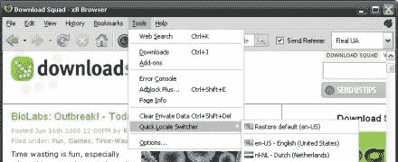

# 用于匿名浏览的 XB 浏览器

> 原文：<https://hackaday.com/2008/06/16/xb-browser-for-anonymous-browsing/>

[下载小队](http://www.downloadsquad.com/2008/06/16/xb-browser-anonymous-web-browsing-for-the-paranoid/)今天突出了 [xB 浏览器](http://xerobank.com/xB_Browser.php)。这是 XeroBank 提供的产品，是 TorPark 项目的后续产品。这款浏览器使用 [Tor 网络](http://www.torproject.org/)对你的浏览进行匿名化，并且不会记住密码、访问过的网站或任何其他个人信息。默认情况下，脚本和插件是不允许的，因为它们可能被[用来识别你的身份](https://wiki.torproject.org/noreply/TheOnionRouter/TorFAQ#TotallyAnonymous)。记住 Tor 只是匿名；当涉及到安全性时，您仍然受到出口节点的支配。

不过这只是免费版本。XeroBank 的用户可以访问匿名邮件服务器和 VPN 服务。如果你是订户，你的 bowser 会话是通过 XeroBank 的服务器池而不是 Tor 网络进行的。我们认为他们应该保持一个独立的产品名称，因为这种区别在 FAQ 之外并不明显。

*   [永久链接](http://xerobank.com/xB_Browser.php)