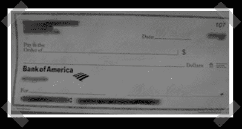

# 检查洗涤漏洞

> 原文：<https://hackaday.com/2008/06/19/check-washing-vulnerabilities/>

【矢】发了一些他其他的作品，但是我发现他的帖子([第一部，](http://planaheist.com/2008/05/check-washing-pt-1/) [第二部](http://planaheist.com/2008/05/check-washing-pt-2-acetone-tests/)，[第三部](http://planaheist.com/2008/05/check-washing-pt-3-alcohol-tests/)和[最后的想法](http://planaheist.com/2008/05/check-washing-final-thoughts/))关于验洗实验还是蛮有意思的。他的结果应该足以让你在开支票时三思。他测试了几种不同的笔，并用丙酮和酒精作为溶剂在 real check 上进行测试。

*   [永久链接](http://planaheist.com/2008/05/check-washing-pt-1/)