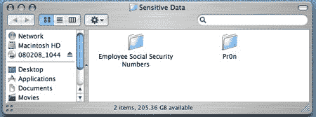

# 使用免费软件查找敏感数据

> 原文：<https://hackaday.com/2008/06/20/finding-sensitive-data-with-freeware/>

当组织的网络发展到一定规模时，很难跟踪每一条敏感信息，如信用卡号或社会保险号。为了找到并保护这些数据，公司经常求助于数据丢失防护(DLP)服务。然而，对于许多组织来说，这并不是一个可行的选择，因为 DLP 服务的部署通常非常昂贵和耗时。

这样的组织并不是完全没有选择:最近一篇关于黑暗阅读的文章列出了几个 DLP 工具，由来自不同大学的团队创作，都可以免费下载和使用。像德克萨斯大学奥斯丁分校的[敏感号码查找器](https://source.its.utexas.edu/groups/its-iso/projects/senf/)和弗吉尼亚理工大学的 [Find_SSN](http://security.vt.edu/findssnccn.html) 这样的程序被设计用来查找计算机和服务器上以敏感信息的典型方式格式化的数据片段(例如，SSN 的 xxx-xx-xxxx)。这种方法经常会导致误报，因此需要一些人为控制措施。它们也无法扫描应用服务器或传输中的其他形式的数据。康奈尔的[蜘蛛](http://www.cit.cornell.edu/security/tools/)可以扫描使用不同协议的各种应用服务器类型。当结合使用时，所有这些应用程序都可以帮助保护您的数据，而无需外包工作的费用。

*   [永久链接](http://www.darkreading.com/document.asp?doc_id=157088)