# 如何制作 RGB 密码锁(第二部分)

> 原文：<https://hackaday.com/2008/06/20/how-to-make-an-rgb-combination-door-lock-part-2/>

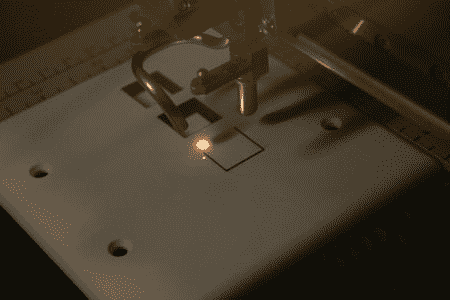
在[第一部分](http://www.hackaday.com/2008/06/12/how-to-make-an-rgb-combination-door-lock-part-1/)中，我们向你展示了如何构建你自己的原型 RGB 键盘。今天我们将展示一些我们创造这个项目的新想法，并把它从原型变成全功能的战斗站 er 门锁。

为了用我们的新电动装置替换旧的门锁，我们必须将其与旧的对齐。一旦设置好，我们就用笔在安装板上画出轨迹，然后开始工作。我们抓了一个 3/8 英寸的钻头，钻出了一个宽度和深度都与撞击体相匹配的洞。然后我们用木凿子清理一些东西，直到洞足够大。罢工需要 12 伏电压才能释放，所以我们必须给它加些电线。我们挖出一个相当长的钻头，钻穿墙壁，钻入罢工安装孔。

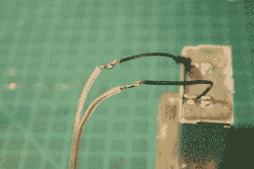
走线是低压的，所以电线不必有什么特别的。我们使用了一些 18 号扬声器线，它很便宜，我们的零件箱里已经有了。拉电线很容易。只要把电线穿进去，用一把尖嘴钳夹住末端就行了。因为我们有 50 英尺的电线要处理，我们把电线拉到我们的工作台上，很快就把它焊接到了罢工的引线上。一旦连接牢固，我们就用绝缘胶带将它们绝缘。不用担心极性，所以只要把事情联系起来，准备好摇滚。

罢工有一个厚的安装凸缘，所以我们不得不从门框表面移除一些木材。在用锤子、平头螺丝刀和木凿花了一些时间后，我们设法切了一个像样的安装槽。一旦线路绝缘，我们拉在松弛和安装罢工与一对三英寸螺丝。

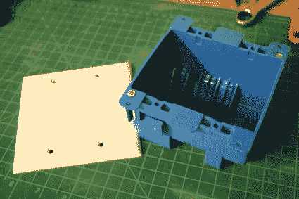
我们将在墙壁上安装键盘，所以我们挑选了一个“老式”的双联电箱和一个双联空白墙板。安装盒子很容易，但我们会带你一路走来。

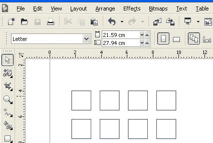
为了制作边框，我们在 CorelDraw 中布置了按钮，并将每个按钮放大了几个百分点。一旦尺寸正确，我们就把边角弄圆以更好地匹配纽扣。

经过几次试切后，我们将墙板放入我们一直使用的激光切割机中。我们意识到，你们中的大多数人都没有这些[令人敬畏的机器](http://epiloglaser.com/mini24_overview.htm)——你可以通过一些仔细的钻孔和 dremel 工作来创造自己的机器(用一些啤酒贿赂当地的标志店可能更容易)。如果你有激光切割，确保你得到一个尼龙墙板，而不是聚氯乙烯板。燃烧聚氯乙烯产生的烟雾是有毒的，空气过滤器不能中和它们。

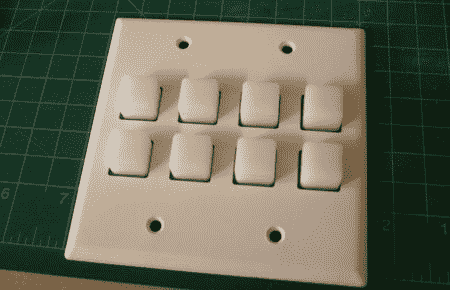
当我们测试安装新的表圈时，我们发现每个按钮底部的弯曲受到阻碍。在这里很难看到，但墙板只有大约 1/32 英寸厚。既然这么薄，扣子就伸出太远了。

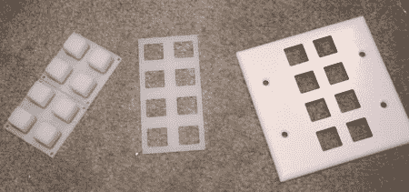
为了解决这两个问题，我们创造了副边框。我们使用相同的激光模板，但是将每个孔扩大了一点。1/8 英寸的丙烯酸树脂为按钮提供了完美的深度，子挡板上的较大孔为按钮提供了弯曲的区域。

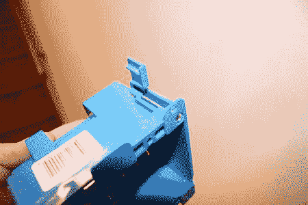
“旧工作”箱设计用于安装到现有干墙中。你只需要为盒子切一个洞，当螺丝拧紧时，这些凸片就会向上翻转，抓住墙壁的内部。

一旦孔切好，就插入盒子并检查是否合适。暂时不要拧紧螺丝——我们将把它拉回来进行快速改装。由于我们将所有硬件安装在墙的另一侧，我们在车间一侧钻了一个洞，以便进行键盘布线。

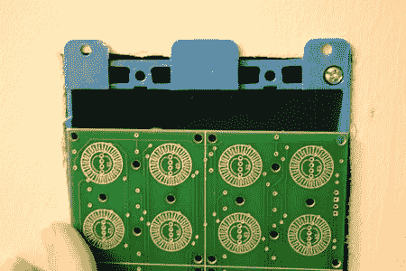
刚好 Spark Fun 的 PC 板和 2 gang box 一样宽。为了使边框齐平，我们需要修剪盒子的边缘。

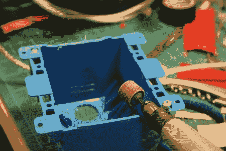
你可以使用你最喜欢的工具，但我们抓起了我们的旋转工具和一个小鼓砂磨钻头。然后，我们将盒子的边缘接地，以允许大约两倍的键盘 PC 板厚度。(您可能需要根据您的挡板设计进行调整。)

最终的拟合是完美的。当盒子从后面支撑板时，干墙的边缘防止板移动。

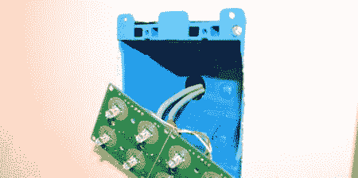
现在，挡板已准备就绪，请标记您的布线，以便您可以在安装后识别它。我们用了一些彩色的电工胶带，并注意到了连接。由于我们使用 Cat-5，您可以很容易地使用 RJ-45 连接器来增加一些模块化。我们不需要它，所以我们只是把电线拉到车间那边。

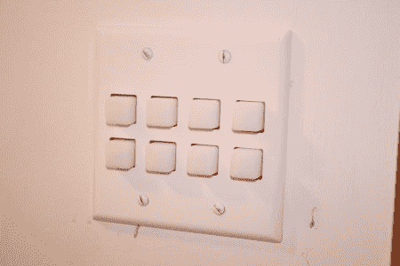
为了完成键盘的安装，我们安装了 PC 板、键盘、亚克力边框，最后是键盘。所有东西实际上都漂浮在键盘下面。在过去的几个月里，这个设计运行得非常完美——只有一个例外。一名参观者用力过猛，将 PC 板弹回到墙盒中。如果需要，您可以在 PC 板后面添加某种支撑柱。

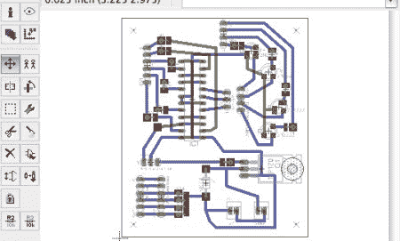
为了创建一个键盘的永久板，我们在[鹰](http://www.cadsoftusa.com/)中布置了一切。由于我们想尝试一些有趣的蚀刻想法，我们使用了超宽的走线，并扩大了焊盘，以提供大量的铜。

做好键盘边框后，我们想用激光切割机尝试一些新花样。我们用喷漆涂了一些覆铜印刷电路板，让它硬化几天。

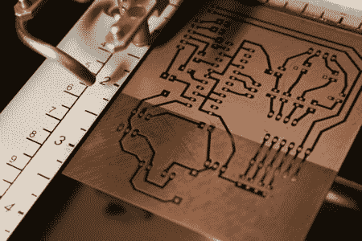
到我们从 eagle 导出设计，并通过 CorelDraw 发送到 Epilog。为了去除所有的油漆，我们必须在激光上运行两次蚀刻作业
。在这里，激光是通过第二轮中途。

即使经过两次作业，铜上仍有细小的残渣。用丙酮(指甲油去除剂)轻轻擦洗板子，去除剩余的残留物。迹线保持完整，铜暴露在蚀刻溶液中。

Radio Shack 不再费心运输氯化铁，但我们想要当地的化学品。我们拿起一些盐酸、过氧化氢、一个谷物容器气泵、气泡垫和一些软管。这种酸在五金店很容易买到。我们建议寻找较小的容器——这是一次性灌装的完美数量。

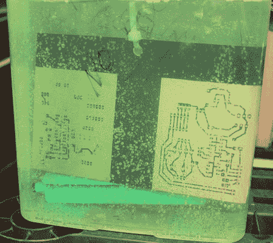
蚀刻木板是通常的显示。气泡有助于搅动铜周围的溶液，加速这个过程。

完成的蚀刻出来相当不错，虽然有点过度蚀刻。将电路板举到灯下是检查顶层/底层对齐的简单方法。板子稍微有点蚀刻过度，但是在花了几周时间摆弄这个过程后，我们决定是时候继续了。

为了在板上钻孔，我们使用了 59 号碳化钨钻头。取代钻床，我们手动运行我们的数控迷你轧机钻孔板。我们只弄坏了一点，那是因为我们用手指按了方向键。

再快速检查一下，板子看起来就完美了。铣床使建造时保持孔在一条线上变得很容易。

完成构建相当容易(棋盘上的红线是一个快速的设计修正)。我们为所有 Arduino 连接添加了跳线，并将键盘上的 Cat-5 直接焊接到新电路板上。我们不会用一步一步的焊接图片来烦你。如果您制作了电路的原型，那么您现在应该对它非常熟悉了。如果你需要一些焊接方面的帮助，一定要看看我们的[焊接介绍](http://www.google.com/url?sa=t&ct=res&cd=2&url=http%3A%2F%2Fwww.hackaday.com%2F2007%2F10%2F26%2Fhow-to-introduction-to-soldering%2F&ei=B-dZSIqaEoryiQH3692bDA&usg=AFQjCNELRsGxMt0eh2uKmFzz8x9-gIRgdQ&sig2=SXPS-hycfK03YDgeuOpO5Q)。

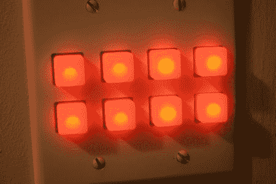
制作边框，蚀刻印刷电路板，焊接电路，安装键盘。剩下唯一要做的就是享受新的键盘…或者开发更多的代码，教它一些新的技巧。

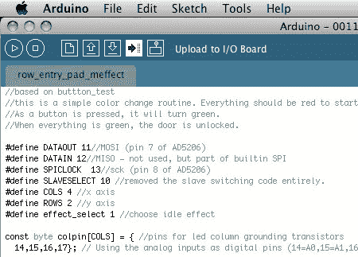

我们承诺会对代码做一些解释，所以我们会让您快速浏览一遍。meffect 键盘代码(此处[可用](http://biobug.org/rgb-keypad/))用于简化项目的键盘程序。前几行初始化了我们工作所需的各种变量。我们添加了关于引脚分配的注释，以帮助简化布线，并帮助人们根据需要进行更改。

驱动数字电位计的代码直接来自本教程的。

控制器通电或复位时，setup()函数运行一次。根据需要设置变量，并将 i/o 引脚设置为其初始状态。

loop()函数是一个永不结束的循环，其中控制器将执行一些任务。业务的主要顺序是读取用于输入的按钮状态。第二，根据矩阵中为每个 LED 状态定义的值，设置电位计，并暂时点亮每个 LED。如果没有检测到动作，则由效果函数设置值。但是，如果检测到动作，效果会暂停，按钮颜色会根据键入的输入数量进行设置。接下来，循环对检测到的所有按钮按压进行计数。如果锁超过定义的数字(在这种情况下，20)，然后垫发红光，状态被重置，它锁定用户约 30 秒。最后的测试是实际的锁码。如果键盘状态与预定义的代码匹配，则键盘会发绿光，门锁会打开大约 5 到 10 秒。

代码非常简单，但是框架可以产生一个更安全的锁。提高安全性的最简单方法是创建一个滚动渐变效果，并在检测到按键时改变 LED 的颜色。这种锁最酷的特点可能是你可以对它进行编程，让它以任何你想要的方式运行和锁定。