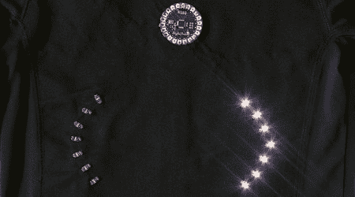

# 转向灯护套操作指南

> 原文：<https://hackaday.com/2008/06/22/turn-signal-jacket-how-to/>

【Leah Buechley】，我们从时的[开始就一直在报道她的作品，她制作了这件可爱的转向灯夹克。项目照片是在三月份发布的，但她的](http://www.hackaday.com/2005/10/05/wearable-led-display/)[只是添加了一个插图丰富的项目指南](http://www.cs.colorado.edu/~buechley/LilyPad/build/turn_signal_jacket.html)。这款夹克基于一款 [LilyPad Arduino](http://www.cs.colorado.edu/~buechley/LilyPad/index.html) ，这是一款轻型 Arduino 板，带有径向衬垫，旨在用于可穿戴项目。你通过将导线穿过焊盘来进行连接。操作方法包括正确连接 LilyPad 部件，然后在确认电线正常工作后，用织物涂料绝缘电线。

该指南对放置电源进行了有趣的讨论。所用的 4 股镀银线的电阻约为 14 欧姆/英尺。因此，如果将电源放在离 LilyPad 一英尺的地方，两根电线合起来有 28 欧姆，导致 1.4V 的压降。电源只有 5V，这意味着 LilyPad 将是 3.6v。3.3V 的电压将导致 Arduino 复位。如果你的阻力太大，你就必须加更多的线。

这件夹克上的电源在领子下面。每个袖口都有一个按钮和一个 LED。该按钮将使夹克闪烁 15 秒钟(也显示在袖子 LED 上)。如果您同时按下两个按钮，它会切换到夜间模式，同时向两个方向闪烁，让您更容易被看到。

*   [永久链接](http://www.cs.colorado.edu/~buechley/LilyPad/build/turn_signal_jacket.html)