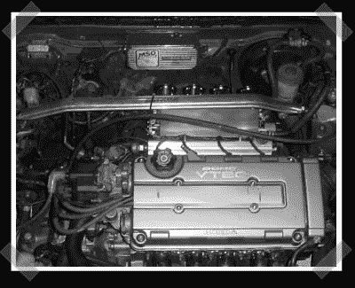

# 摩托车节气门体为您的汽车

> 原文：<https://hackaday.com/2008/06/22/motorcycle-throttle-bodies-for-your-car/>

【Dem _ z】改装了他的本田 VTEC 引擎，使用了一套来自 2001 年铃木 GSX-R 摩托车的[独立节气门体](http://forums.evolutionm.net/showthread.php?t=241327)。节气门体上的燃料注入塞用环氧树脂封闭，节气门体仅用于为每个气缸提供单独的蝶形阀。这个不太符合我们的待办事项列表，但它绝对是一个黑客。

[bender386]先发现了[我的错误](http://www.hackaday.com/2005/09/16/individual-throttle-body-setup/)，所以我要送他一点日常用品。同时，这里有一个小奖励:看看这个自制的[变形镜头](http://www.zuggsoft.com/theater/prism.htm)。原生 2.35:1 投影仪已经开始出现，但它们非常昂贵。通过添加一些图像处理和一个镜头来拉伸投影图像，您可以获得全幅投影并使用投影仪上的所有像素。

*   [永久链接](http://forums.evolutionm.net/showthread.php?t=241327)