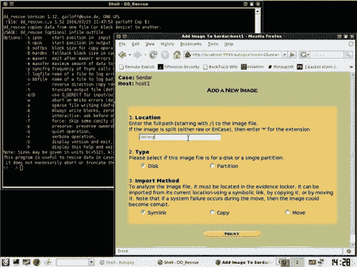

# 开源数据恢复工具

> 原文：<https://hackaday.com/2008/06/24/open-source-data-recovery-tools/>

《信息周刊》有一篇关于[开源数据恢复工具](http://www.informationweek.com/news/storage/disaster_recovery/showArticle.jhtml?articleID=208403254&pgno=1&queryText=&isPrev=)的文章。你使用什么类型的工具将取决于情况的严重性。你可以使用为恢复而设计的 Linux 发行版，如 [SystemRescueCD](http://www.sysresccd.org/) 或 [Partedmagic](http://partedmagic.com/) (后者对用户更友好)。像[回溯](http://www.remote-exploit.org/backtrack.html)这样的安全工具发行版也很有帮助； [Helix](http://www.e-fense.com/helix/) 专为取证工作而设计。dd 是一个标准的*nix 工具，用于映像驱动器，但是类似于 [TestDisk](http://www.cgsecurity.org/wiki/TestDisk) 的东西可以帮助您修复分区表以进行整个磁盘恢复。大多数删除操作不会覆盖数据，这意味着您可以使用文件雕刻来捕获丢失的文件。 [PhotoRec](http://www.cgsecurity.org/wiki/PhotoRec) 能够查找多种常见格式的文件。最后，如果你有一些严肃的法医工作要做，那么还有[侦探工具包](http://www.sleuthkit.org/sleuthkit/desc.php)和许多其他命令行工具。

作为附录，OStatic 整理了一份保护你的系统的 5 个免费软件工具的列表。

*   [永久链接](http://www.informationweek.com/news/storage/disaster_recovery/showArticle.jhtml?articleID=208403254&pgno=1&queryText=&isPrev=)