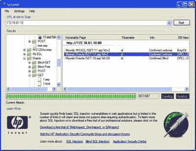

# 爬行+ SQL 注入与 Scrawlr

> 原文：<https://hackaday.com/2008/06/24/crawling-sql-injection-with-scrawlr/>

Scrawlr 是惠普网络安全研究小组推出的最新工具。它是为了应对今年发生在网络上的[大量 SQL 注入攻击](http://www.microsoft.com/technet/security/advisory/954462.mspx)而建立的。大多数这些易受攻击的网站都是通过谷歌搜索找到的，所以 Scrawlr 也是这样工作的。将它指向你的网络服务器，它会[抓取所有的页面，并评估 URL 参数](http://www.communities.hp.com/securitysoftware/blogs/spilabs/archive/2008/06/23/finding-sql-injection-with-scrawlr.aspx)，看看它们是否容易受到冗长注入的攻击。如果遇到任何问题，它会报告 SQL server 和表名。

它现在只支持 1500 页，不能做认证或盲注。它仍然是一个免费的工具，也是一个很好的方法来识别你的网站是否容易受到自动工具通过搜索引擎找到你的网站。

[via [Acidus](http://www.memestreams.net/users/acidus/blogid10328589/)

*   [永久链接](http://www.communities.hp.com/securitysoftware/blogs/spilabs/archive/2008/06/23/finding-sql-injection-with-scrawlr.aspx)