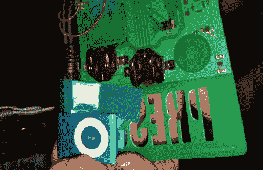

# Defcon 徽章黑客大赛

> 原文：<https://hackaday.com/2008/06/25/defcon-badge-hacking-contest/>

【乔格兰】连续第三年设计 Defcon 徽章。就像前几年一样，他们将在[举办徽章黑客大赛](https://forum.defcon.org/showthread.php?t=9502)。不过这一次，他们会提前泄露线索。早期的竞赛往往令人沮丧，因为需要专门的设备来与微控制器对话。希望今年会更容易实现。徽章的规格尚未发布，但在去年的 95 LED 滚动品牌之后，我们迫不及待地想看看今年会带来什么。[Joe]已经发布了关于[上一届](http://www.grandideastudio.com/portfolio/defcon-14-badge/) [两届](http://www.grandideastudio.com/portfolio/defcon-15-badge/)徽章设计和结果竞赛的信息。

*   [永久链接](https://forum.defcon.org/showthread.php?t=9502)