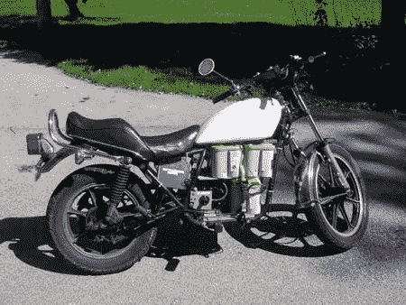

# 川崎 KZ440 电动转换

> 原文：<https://hackaday.com/2008/06/25/kawasaki-kz440-electric-conversion/>

【本·尼尔森】甚至不知道如何骑摩托车，当他开始驾驶这辆[电动改装的 1981 年川崎 KZ440](http://web.mac.com/benhdvideoguy/cycle/Welcome.html) 。引擎并不是一个损失，因为当他花 100 美元买下这辆自行车时，它还没有运转。永磁 Etek 电机售价 500 美元，四块黄色电池每块 160 美元(图中只有三块)。他说大部分改装工作只花了两个周末。最终，仍然合法的街道骑行平均每次充电 20 英里，最高时速 45 英里。

一天有更多的电动摩托车在出租:

*   [电动摩托车](http://www.hackaday.com/2006/10/11/electric-motorcycle/)
*   [电动(马达)循环额外](http://www.hackaday.com/2007/05/07/electric-motor-cycle-extra/)
*   【2008 年制造商博览会:电动摩托车

[通过[ECOM oder](http://www.ecomodder.com/blog/2008/06/24/diy-electric-motorcycle-kicks-butt-blows-up/)

*   [永久链接](http://web.mac.com/benhdvideoguy/cycle/)