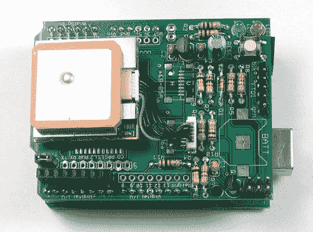

# GPS 测井 Arduino 屏蔽

> 原文：<https://hackaday.com/2008/06/28/gps-logging-arduino-shield/>

ladyada 继续生产越来越多有趣的 Arduino 盾牌。这个新的 [GPS 记录器](http://ladyada.net/make/gpsshield/index.html)插入标准 Arduino 板，支持四个不同的 [GPS 接收器模块](http://ladyada.net/make/gpsshield/modules.html)。在电路板的背面是一个 SD 卡插槽，它将坐标存储在一个文本文件中。总运行时间从 5 小时到 20 小时不等，取决于您选择如何为设备供电以及如何使用设备。您读取设备的频率以及您是否保持 GPS 锁定将影响[功耗](http://ladyada.net/make/gpsshield/power.html)。像 ladyada 的所有项目一样，你会在她的网站上找到很棒的建设指南和示例代码。

*   [永久链接](http://ladyada.net/make/gpsshield/)