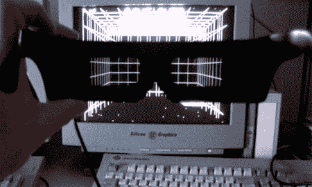

# SGI 的 3D 眼镜

> 原文：<https://hackaday.com/2008/06/30/3d-glasses-for-an-sgi/>

【马克·霍克斯特拉】是一个真正的 SGI 爱好者，他用这些 [3D 眼镜为一个 SGI](http://geektechnique.org/projectlab/851/making-3d-glasses-for-a-silicon-graphics) 证明了这一点。利用 SGI 的立体视口，[Hoekstra]为一副 CrystalEyes 眼镜创建了一个控制器，允许它们与 SGI 一起使用。

【Hoekstra】用的是[【m . c . d . Roos】的类似项目](http://www.roosmcd.dds.nl/oldsite/)的原理图，用的是老华硕的 3D VR 眼镜。这个项目理论上可以用任何液晶快门眼镜来完成，唯一重要的是要知道眼镜的最大快门电压。[Hoekstra]仅凭常识摸索着搭建棋盘，设法避免了任何失误。电路板只与眼镜有三个连接:一个连接到左镜片，一个连接到右镜片，还有一根接地线。在用 LM324 芯片和 perf 板的定制部分构建控制器板后，他了解到他需要一个能够以 100Hz 或每只眼睛 50Hz 显示相对高的位深度的显示器。他在棋盘上做了最后几分钟的修改(忘记了接地保险丝)后，用一个名为 Hacknoid 的游戏测试了眼镜，他很快就被他的功能性 3D 眼镜弄得头晕目眩。

*   [永久链接](http://geektechnique.org/projectlab/851/making-3d-glasses-for-a-silicon-graphics)