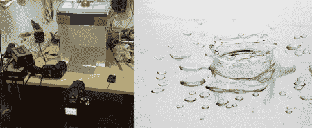

# Arduino 照片实验室

> [https://hacked ay . com/2008/06/30/arduino-photolab/](https://hackaday.com/2008/06/30/arduino-photolab/)

[水滴摄影](http://64.233.179.104/translate_c?hl=en&sl=fr&tl=en&u=http://www.equinoxefr.org/index.php/post/2008/06/29/arduino-photolab/)(链接译自法语)通常能拍出简单而美丽的图像，但曝光的时机可能会很棘手。拍照太早或太晚都会导致你错过这个动作，这个动作只持续几分之一秒。equinox efr([华硕 WL500GP 音频黑客](http://www.hackaday.com/2008/06/15/asus-wl500gp-audio-hack/)背后的人)想出了一个解决这个问题的方法，使用运行 Arduino 环境的 ATmega168 电路。该电路控制一个装有液体的注射器，并被远程触发以将一滴液体释放到黑暗的腔室中。快门打开的相机连接到小室，在液滴撞击之前，它穿过红外传感器，触发闪光灯在几毫秒后关闭，捕捉撞击的独特冠状形状。目前还没有可用的原理图，但帖子底部的评论表明，很快就会有一个。

*   [永久链接](http://64.233.179.104/translate_c?hl=en&sl=fr&tl=en&u=http://www.equinoxefr.org/index.php/post/2008/06/29/arduino-photolab/)