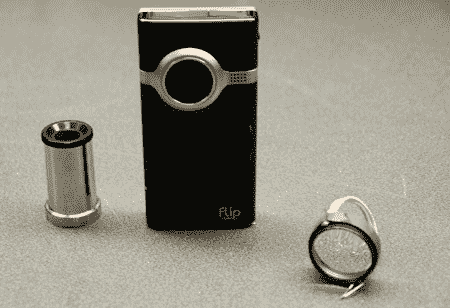

# 翻转相机显微镜和微距镜头

> 原文：<https://hackaday.com/2008/07/01/flip-camera-microscope-and-macro-lenses/>

[翻转相机](http://www.mahalo.com/Flip_Camera)好玩又好用，但不是特别万能。如果你用翻盖拍摄微距照片效果不佳，你可能会对[这些 DIY 镜头](http://www.gearlog.com/2008/07/diy_macro_lens_and_microscope.php)感兴趣。一个是宏观镜头，用于拍摄小东西的照片和视频，另一个是显微镜，用于拍摄更小的东西。

要制作微距镜头，你需要一副双筒望远镜、一些橡皮筋和回形针。只需从双筒望远镜前部取下镜片，连同固定镜片的塑料外壳。将一根对折的橡皮筋穿到塑料外壳上，并用回形针上的小段固定住。现在将镜头放在翻盖的镜头前，并用橡皮筋绑住翻盖。

显微镜的目镜不使用这种连接方法，只需将它放在翻盖前面。同样的过程不能用在这里，因为获得适当的焦点需要它与相机保持不同的距离，而不是像微距镜头那样与相机齐平。无论如何，这是一个简单的模式，可以让你立刻拍下虫子和其他小东西的照片。休息后观看镜头动作的视频。

<http://www.youtube.com/v/-jNife4uTsI&amp;hl=en&amp;rel=0&amp;color1=0x3a3a3a&amp;color2=0x999999>

  
这是微距镜头。
<http://www.youtube.com/v/ka9LFcRiL5E&amp;hl=en&amp;rel=0&amp;color1=0x3a3a3a&amp;color2=0x999999>

  
这是显微镜的目镜。

*   [永久链接](http://www.gearlog.com/2008/07/diy_macro_lens_and_microscope.php)