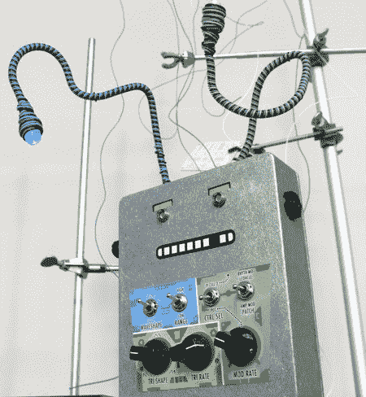

# ThingamaKIT:制作你自己的 Thingamagoop

> 原文：<https://hackaday.com/2008/07/03/thingamakit-make-your-own-thingamagoop/>

Bleep Labs’ [Thingamagoop](http://bleeplabs.com/thingamagoop/) is a small synthesizer packed with wacky controls for generating unique sounds; you can now [build an expanded version yourself with the ThingamaKit](http://bleeplabs.com/thingamakit/). Made “because there are not nearly enough beeping, zapping, bixxerfouping, anthropomorphic synthesizer monsters in the world,” it generates sounds of different pitches depending on the type and intensity of light hitting a photocell on the front panel. It’s most unique feature, is its LEDacle, which is something like a tentacle with an LED on the end. This can be pointed towards the photocell to modulate the sound. Output is through a 1/4″ audio jack.

Bleep Labs 出售完全组装的 Thingamagoops，售价 100 美元，但新的 DIY 套件半价出售。Thingamagoop 的套件版本有更多的控件，两个光电传感器和两个 LEDacles。有没有外壳都可以买，不需要任何复杂的布线。休息之后，请观看一些正在运行的东西的视频。

<http://www.youtube.com/v/UFaU6Euuytg&amp;hl=en&amp;fs=1&amp;rel=0&amp;color1=0x3a3a3a&amp;color2=0x999999>

*   [永久链接](http://bleeplabs.com/thingamakit/)