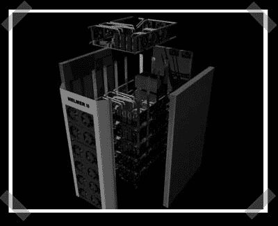

# 渲染下一个渲染场

> 原文：<https://hackaday.com/2008/07/05/render-your-next-render-farm/>

你可能还记得【Janne】的[宜家商场](http://www.hackaday.com/2008/04/23/24-core-ikea-cluster/)。现在他已经有了几个梦寐以求的装备，所以他开始对它们进行 3D 渲染。 [Helmer 2](http://helmer2.sfe.se/) 被设计成包含 24 个视频卡，连接到六个带四核 CPU 的主板上。(AMD 甚至有足够的兴趣给他发送了一些 CPU 以开始使用)渲染对于设计定制的铜热管和铝散热片外壳来说真的很方便。仍然很无聊，他用 2160 块显卡拼凑了一个 [4 PetaFLOP 机器的渲染图。
更新:修正了](http://helmer3.sfe.se/)[头盔 2](http://helmer2.sfe.se/) 的链接。

*   [永久链接](http://helmer2.sfe.se/)